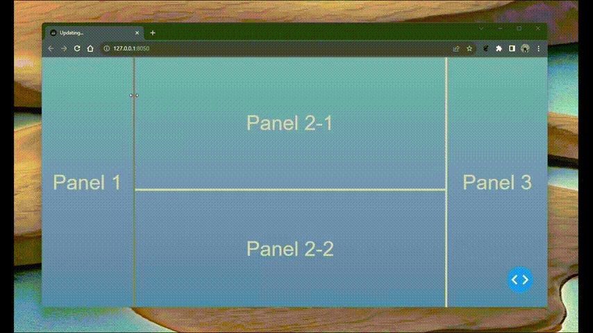

# Dash Resizable Panels



This module provides a Dash component for creating resizable panels. It is based on the 
[`react-resizable-panels`](https://github.com/bvaughn/react-resizable-panels) React component.

## Usage

Here's a two split panels example:

```python
from dash_resizable_panels import PanelGroup, Panel, PanelResizeHandle
from dash import Dash, html

app = Dash(__name__)

app.layout = html.Div([
    PanelGroup(
        id='panel-group',
        children=[
            Panel(
                id='panel-1',
                children=[
                    html.H1('Black')
                ],
            ),
            PanelResizeHandle(html.Div(style={"backgroundColor": "grey", "height": "100%", "width": "5px"})),
            Panel(
                id='panel-2',
                children=[
                    html.H1('White')
                ],
                style={"backgroundColor": "black", "color": "white"}
            )
        ], direction='horizontal'
    )
], style={"height": "100vh"})


if __name__ == '__main__':
    app.run_server(debug=True)

```

**Note:** The `PanelResizeHandle` component is required to be placed between each `Panel` component.
`PanelResizeHandle` needs to have a child component so that it can be rendered.
In the example above, the child component is a `html.Div` with a grey background color.


Look in to `usage.py` for a nested panels example.

## Installation

```bash
pip install dash-resizable-panels
```

## Attributes

### PanelGroup

| Attribute | Description | Type | Default |
| --- | --- | --- | --- |
| id | The ID used to identify this component in Dash callbacks | string | |
| children | The children of this component | Dash components | |
| direction | The direction of the panels. Can be either `horizontal` or `vertical` | string | `horizontal` |
| className | The class name of the component | string | |
| style | The style of the component | dict | |
| autoSaveId | The ID used to save the group arrangement via local storage | string | |


### Panel

| Attribute | Description | Type | Default |
| --- | --- | --- | --- |
| id | The ID used to identify this component in Dash callbacks | string | |
| children | The children of this component | Dash components | |
| className | The class name of the component | string | |
| defaultSizePixels | The default size of the panel in pixels | int | `0` |
| defaultSizePercentage | The default size of the panel as a percentage of the parent panel group | int | `0` |
| minSizePixels | The minimum size of the panel in pixels | int | `0` |
| minSizePercentage | The minimum size of the panel as a percentage of the parent panel group | int | `0` |
| maxSizePixels | The maximum size of the panel in pixels | int | `0` |
| maxSizePercentage | The maximum size of the panel as a percentage of the parent panel group | int | `0` |
| order | The order of the panel within group; Required for groups with conditionally rendered panels | int | `0` |
| collapsible | Whether the panel can be collapsed | bool | `False` |
| collapsedSizePixels | The size of the panel when collapsed | int | `0` |
| collapsedSizePercentage | The size of the panel when collapsed as a percentage of the parent panel group | int | `0` |
| style | The style of the component | dict | |

### PanelResizeHandle

| Attribute | Description | Type | Default |
| --- | --- | --- | --- |
| id | The ID used to identify this component in Dash callbacks | string | |
| children | The children of this component | Dash components | |
| className | The class name of the component | string | |
| style | The style of the component | dict | |
| disable | Whether the resize handle is disabled | bool | `False` |

## Sponsor

If you like this project and want to support it, please consider becoming a sponsor of the parent project
[`react-resizable-panels`](https://github.com/bvaughn/react-resizable-panels) by [Brian Vaughn](https://github.com/sponsors/bvaughn/)